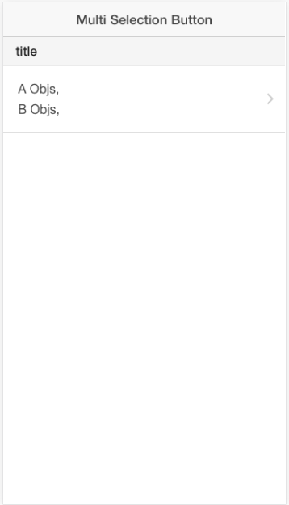

#Multi Selector Button
This software is a ionic directive that implements a multi selector button. It uses a modal view that shows a list of selectable objects.

##Snapshot
### No selected items

### Selecting items

### Selected items
